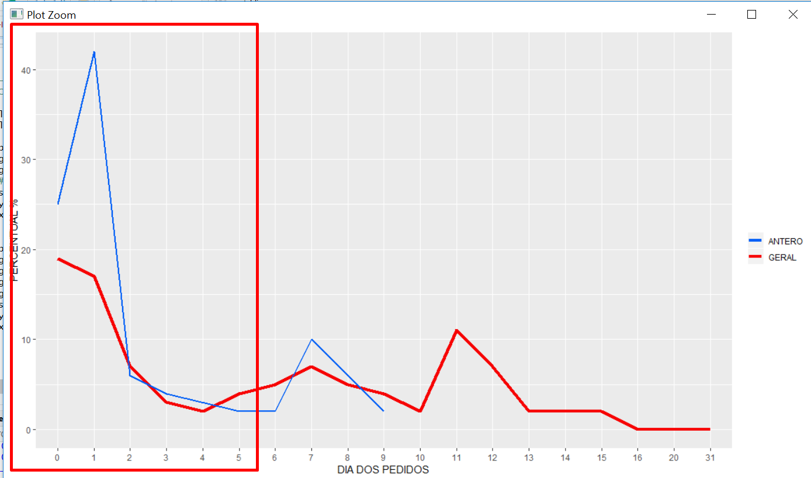

# sharebook-data-analysis

## Contribua

Contribua você também com sua própria análise. Nos ajude a entender e melhorar a experiência do nosso app.

## análise 1: donation-lifecycle

O objetivo dessa análise é verificar qual a probabilidade de um livro ser pedido a partir da dia que o mesmo foi inserido em nossa vitrine virtual. Nossa intenção é gerar insights para responder algumas perguntas:

- Quanto tempo um livro deve ficar na vitrine?
- Será que tem muitos pedidos nos primeiros dias?
- Como o estilo pessoal de um facilitador afeta os pedidos?
